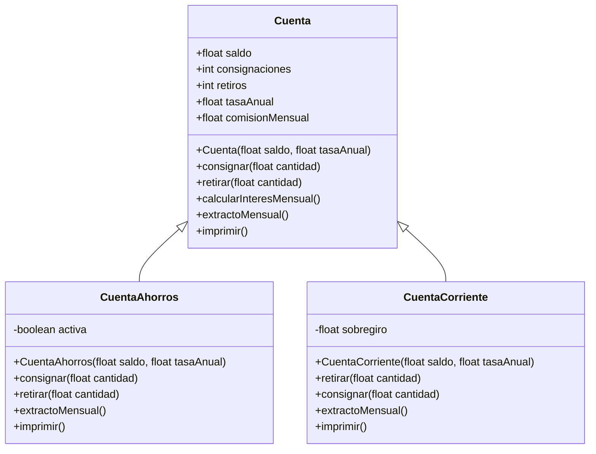

## Nombre:
### -John Steban Morales Ceron

```mermaid
classDiagram
    class Cuenta {
        +float saldo
        +int consignaciones
        +int retiros
        +float tasaAnual
        +float comisionMensual
        +Cuenta(float saldo, float tasaAnual)
        +consignar(float cantidad)
        +retirar(float cantidad)
        +calcularInteresMensual()
        +extractoMensual()
        +imprimir()
    }
    class CuentaAhorros {
        -boolean activa
        +CuentaAhorros(float saldo, float tasaAnual)
        +consignar(float cantidad)
        +retirar(float cantidad)
        +extractoMensual()
        +imprimir()
    }
    class CuentaCorriente {
        -float sobregiro
        +CuentaCorriente(float saldo, float tasaAnual)
        +retirar(float cantidad)
        +consignar(float cantidad)
        +extractoMensual()
        +imprimir()
    }
    Cuenta <|-- CuentaAhorros
    Cuenta <|-- CuentaCorriente
```